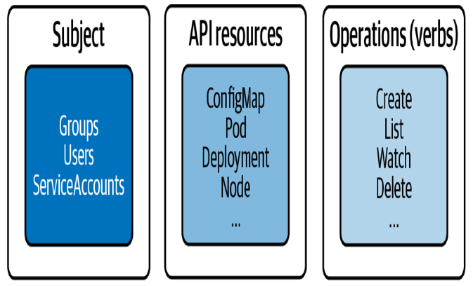
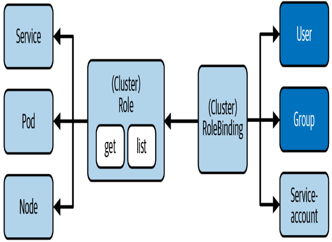
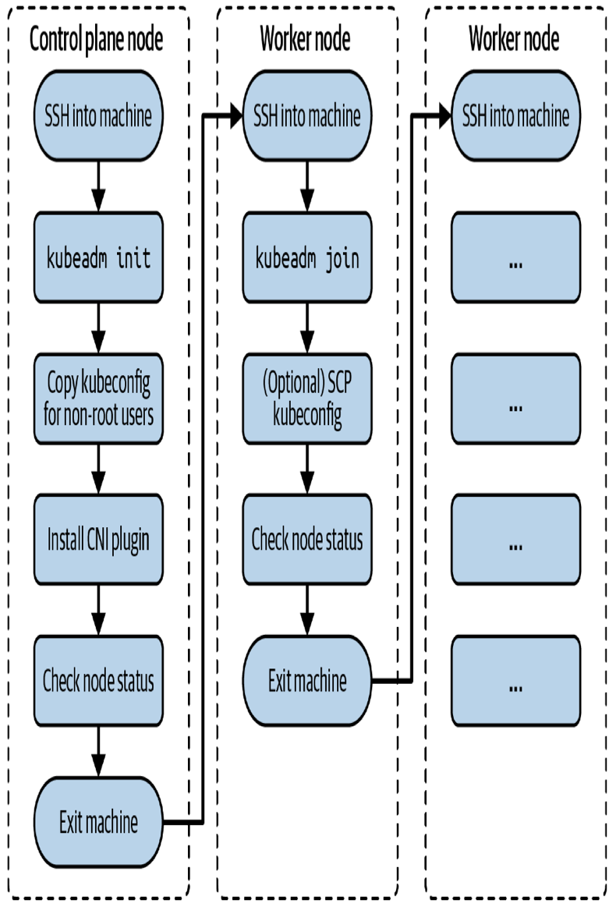

# Certified Kubernetes Administrator (CKA) Study Guide

## 1. Introduction

### Curriculum

Sections of the CKA:
- 25%: Cluster Architecture, Installation and Configuration
- 15%: Workloads and Scheduling
- 20%: Services and Networking
- 10%: Storage
- 30%: Troubleshooting

### Concepts

Main concepts related to K8s cluster are:

<center></center>

### Instructions and Recommendations

There are a few instructions for CKA examen:
- You have 2h of time to solve the examen.
- You can use and navigate through Kubernetes documentation.
- There are 6 clusters to be used with different namespaces
- Avoid waste of time typing more than needed (for example, use alias k=kubectl).
- Be familiar with `kubectl`, `kubeadm`and `etcdctl`.
- Command `kubectl api-resources` shows the short name version of each k8s resource.
- Delete using `kubectl delete <resource> --force --grace-period=0` to make it faster.
- Use `kubectl explain <JSONPath>`to get all fields of a resource.

## 2. Cluster Architecture, Installation and Configuration

At a high level, this chapter covers the following concepts:
- Understanding RBAC.
- Installation of a cluster with `kubeadm`.
- Upgrading a version of a K8s cluster with `kubeadm`.
- Backing up and restoring *etc* with `etcdtcl`.
- Understanding a highly available Kubernetes cluster.

### Role-Based Access Control

RBAC defines policies for users, groups, and processes by allowing or disallowing access
to manage API resources. First of all, the differente between **roles** and *clusterroles*
are than firsts are applied only to a specific namespace, while the second one is applied
to entire cluster.

#### RBAC High-Level Overview

RBAC helps with implementing a variety of use cases:
- Establishing a system for users with different roles to access a set of K8s resources
- Controlling processes running in a Pod and the operations they can perform via the K8s Api
- Limiting the visibility of certain resources per namespace

<center></center>

#### Creating a Subject
Users and groups are **not stored** in *etcd*, the K8s database, and are meant for processes
running outside of the cluster. Service accounts exists as objects in K8s and are used by processes
running inside of the cluster.

##### Users accounts and groups
Kubernetes does not represent a user as with an API resource. Calls to the API server with a user
need to be authenticated. Kubernetes offers a variety of authentication methods for those API requests:
- X.509 client certificate (OpenSSL client certificate)
- Basic authentication (Username and password)
- Bearer tokens (OpenID or webhooks)

##### ServiceAccount
Kubernetes cluster already comes with a ServiceAccount, which is the *default* ServiceAccount that
lives in the *default* namespace. Any pod that does not explicitly assign a ServiceAccount uses the
*default* ServiceAccount. For example, services running in a pod like *Helm* (I suppose that it refers
to *Helm2*) needs to authenticate to the K8s API through authentication token, so, a ServiceAccount
can be assigned to a Pod and mapped to RBAC rules.

After creating a ServiceAccount you will find a secret of type *kubernetes.io/service-account-token*.

#### Understanding RBAC API Primitives
There are two:
- Role --> The Role API primitive declares the API resources and their operations this rule should
operate on. For example, you may want to say "allow listing and deleting of pods". Any operation 
that is not spelled out explictly is disallowed as soon as it is bound to the subject.
- RoleBinding --> Binds the role object to the subject

<center></center>

#### Default User-Facing Roles
Kubernetes defines a set of default roles. You can assign them to a subject via a RoleBinding
or define your own:
- cluster-admin (read-write to all resources in all namespaces)
- admin (read and write to all resources in namespace including roles and rolebindings)
- edit (read and write access to resources in namespace except roles and rolebindings. Also
provides access to secrets)
- view (read-only access to resources in namespace except roles, rolebindings and secrets)

For creating new roles and rolebindings you will have to use a context that allows for creating
or modifying them, that is, cluster-admin or admin.

#### Creating Roles and RoleBindings
The following commands will create a role and rolebinding for the *default* namespace.
```
kubectl create role read-only --verb=list,get,watch --resource=pods,deployments,services
kubectl create rolebinding read-only-binding --role=read-only --user=johndoe
```

**Bonus**: At any given time, you can check a user's permissions with `kubectl auth can-i --list
--as johndoe`

**Bonus 2**: We can agregate rules from clusterroles (not for roles apparently) to mix different
clusterroles. The following code shows the differences:
```
apiVersion: rbac.authorization.k8s.io/v1
kind: ClusterRole
metadata:
    name: list-pods
    namespace: rbac-example
    labels:
        rbac-pod-list: "true"
rules:
- apiGroups:
    - ""
    resources:
    - pods
    verbs:
    - list
---
apiVersion: rbac.authorization.k8s.io/v1
kind: ClusterRole
metadata:
    name: delete-services
    namespace: rbac-example
    labels:
        rbac-service-delete: "true"
rules:
- apiGroups:
    - ""
    resources:
    - services
    verbs:
    - delete
---
apiVersion: rbac.authorization.k8s.io/v1
kind: ClusterRole
metadata:
    name: pods-services-aggregation-rules
    namespace: rbac-example
    aggregationRule:
        clusterRoleSelectors:
        - matchLabels
            rbac-pod-list: "true"
        - matchLabels
            rbac-service-delete: "true"
rules: []
```

Take care specifying *rules* in clusterrolebinding, because they will overwrite the clusterrole rules.

### Creating and Managing a Kubernetes Cluster

**Note**: This section will be managed using the environment created using
Vagrant related to this [Github Repository](https://github.com/emmaliaocode/vagrant-vmware-arm.git)


The low-level command-line tool for performing cluster bootstrapping operations
is called *kubeadm*. It is not meant for provisioning the underlying infrastructure
(that's the purpose of infrastructure automation tools like Ansible or Terraform).

<center></center>

#### Initializing the Control Plane Node

Start by initializaing the control plane on the control plane node. It is the machine responsible 
for hosting  the API server, etcd, and other components important to managing the K8s cluster.

Initialize the control plane using the `kubeadm init` command. You will need to add the following 
two command-line options: provide the IP addresses for the Pod network with the option 
`--pod-network-cidr`. With the option `--apiserver-advertise-address`, you can declare the IP 
address the API server will advertise to listen on.

Example:
    `sudo kubeadm init --pod-network-cidr 172.18.0.0/16 --apiserver-advertise-address 10.8.8.10`

##### Error related to IPv4
```
[ERROR FileContent--proc-sys-net-bridge-bridge-nf-call-iptables]: /proc/sys/net/bridge/bridge-nf-call-iptables does not exist
[ERROR FileContent--proc-sys-net-ipv4-ip_forward]: /proc/sys/net/ipv4/ip_forward contents are not set to 1
```

**Solution**:
From [here](https://v1-28.docs.kubernetes.io/docs/setup/production-environment/container-runtimes/)
```
cat <<EOF | sudo tee /etc/modules-load.d/k8s.conf
overlay
br_netfilter
EOF

sudo modprobe overlay
sudo modprobe br_netfilter

# sysctl params required by setup, params persist across reboots
cat <<EOF | sudo tee /etc/sysctl.d/k8s.conf
net.bridge.bridge-nf-call-iptables  = 1
net.bridge.bridge-nf-call-ip6tables = 1
net.ipv4.ip_forward                 = 1
EOF

# Apply sysctl params without reboot
sudo sysctl --system
```

Verify that `br_netfilter` and `overlay` modules are loaded by running the following commands:
```
lsmod | grep br_netfilter
lsmod | grep overlay
```

##### Error related to CRI
```
[ERROR CRI]: container runtime is not running: output: time="2024-02-28T10:45:09Z" level=fatal msg="validate service connection: validate CRI v1 runtime API for endpoint \"unix:///var/run/containerd/containerd.sock\": rpc error: code = Unavailable desc = connection error: desc = \"transport: Error while dialing: dial unix /var/run/containerd/containerd.sock: connect: no such file or directory\""
, error: exit status 1
```

**Solution**:
This happens because no *Container Runtime Interface (CRI)* is installed in the node. By default it
tries to use containerd (packed by Docker), but we could use CRI-O (packed by RedHat). Here is
[examples](https://www.tutorialworks.com/difference-docker-containerd-runc-crio-oci/)

Install containerd with the [following instructions](https://www.howtoforge.com/how-to-install-containerd-container-runtime-on-ubuntu-22-04/):

There are two options, manually and using APT Docker repository:

**Option 1**:
```
wget https://github.com/containerd/containerd/releases/download/v1.6.8/containerd-1.6.8-linux-amd64.tar.gz
sudo tar Cxzvf /usr/local containerd-1.6.8-linux-amd64.tar.gz

wget https://github.com/opencontainers/runc/releases/download/v1.1.3/runc.amd64
sudo install -m 755 runc.amd64 /usr/local/sbin/runc

which runc

wget https://github.com/containernetworking/plugins/releases/download/v1.1.1/cni-plugins-linux-amd64-v1.1.1.tgz

mkdir -p /opt/cni/bin
sudo tar Cxzvf /opt/cni/bin cni-plugins-linux-amd64-v1.1.1.tgz

sudo mkdir -p /etc/containerd/
containerd config default | sudo tee /etc/containerd/config.toml

sudo sed -i 's/SystemdCgroup \= false/SystemdCgroup \= true/g' /etc/containerd/config.toml

sudo curl -L https://raw.githubusercontent.com/containerd/containerd/main/containerd.service -o /etc/systemd/system/containerd.service

sudo systemctl start containerd

sudo systemctl daemon-reload
sudo systemctl enable containerd
```

**Option 2** (Used this --> not working):
```
sudo apt install \
    ca-certificates \
    curl \
    gnupg \
    lsb-release

sudo mkdir -p /etc/apt/keyrings
curl -fsSL https://download.docker.com/linux/ubuntu/gpg | sudo gpg --dearmor -o /etc/apt/keyrings/docker.gpg

echo \
    "deb [arch=$(dpkg --print-architecture) signed-by=/etc/apt/keyrings/docker.gpg] https://download.docker.com/linux/ubuntu \
    $(lsb_release -cs) stable" | sudo tee /etc/apt/sources.list.d/docker.list > /dev/null

sudo apt update
sudo apt install -y containerd.io

sudo systemctl start containerd
sudo systemctl enable containerd

sudo mv etc/containerd/config.toml etc/containerd/config.toml.orig
containerd config default | sudo tee /etc/containerd/config.toml

sudo sed -i 's/SystemdCgroup \= false/SystemdCgroup \= true/g' /etc/containerd/config.toml

wget https://github.com/containernetworking/plugins/releases/download/v1.1.1/cni-plugins-linux-amd64-v1.1.1.tgz

sudo mkdir -p /opt/cni/bin
sudo tar Cxzvf /opt/cni/bin cni-plugins-linux-amd64-v1.1.1.tgz

sudo systemctl restart containerd
```

##### Start using cluster
After that, to start using your cluster, you need to run the following as a regular user:
    ```
        mkdir -p $HOME/.kube
        sudo cp -i /etc/kubernetes/admin.conf $HOME/.kube/config
        sudo chwon $(id -u):$(id -g) $HOME/.kube/config
    ```

After that, deploy a pod network to the cluster with `kubectl apply -f podnetwork.yaml` with one
of the options listed at [K8s Addons](https://kubernetes.io/docs/concepts/cluster-administration/addons/)

Then you can join any number of worker nodes by running the following on each as root:
    `kubeadm join 10.8.8.10:6443 --token `
