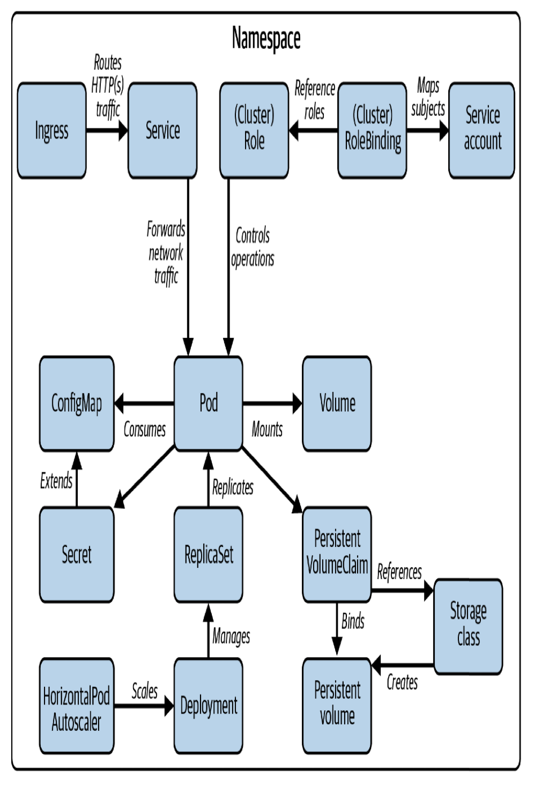

# Certified Kubernetes Administrator (CKA) Study Guide

## 1. Introduction

### Curriculum

Sections of the CKA:
- 25%: Cluster Architecture, Installation and Configuration
- 15%: Workloads and Scheduling
- 20%: Services and Networking
- 10%: Storage
- 30%: Troubleshooting

### Concepts

Main concepts related to K8s cluster are:

### Instructions and Recommendations

There are a few instructions for CKA examen:
- You have 2h of time to solve the examen.
- You can use and navigate through Kubernetes documentation.
- There are 6 clusters to be used with different namespaces
- Avoid waste of time typing more than needed (for example, use alias k=kubectl).
- Be familiar with `kubectl`, `kubeadm`and `etcdctl`.
- Command `kubectl api-resources` shows the short name version of each k8s resource.
- Delete using `kubectl delete <resource> --force --grace-period=0` to make it faster.
- Use `kubectl explain <JSONPath>`to get all fields of a resource.

## 2. Cluster Architecture, Installation and Configuration

At a high level, this chapter covers the following concepts:
- Understanding RBAC.
- Installation of a cluster with `kubeadm`.
- Upgrading a version of a K8s cluster with `kubeadm`.
- Backing up and restoring *etc* with `etcdtcl`.
- Understanding a highly available Kubernetes cluster.

### Role-Based Access Control

RBAC defines policies for users, groups, and processes by allowing or disallowing access
to manage API resources. First of all, the differente between **roles** and *clusterroles*
are than firsts are applied only to a specific namespace, while the second one is applied
to entire cluster.

#### RBAC High-Level Overview

RBAC helps with implementing a variety of use cases:
- Establishing a system for users with different roles to access a set of K8s resources
- Controlling processes running in a Pod and the operations they can perform via the K8s Api
- Limiting the visibility of certain resources per namespace

#### Creating a Subject
Users and groups are **not stored** in *etcd*, the K8s database, and are meant for processes
running outside of the cluster. Service accounts exists as objects in K8s and are used by processes
running inside of the cluster.

##### Users accounts and groups
Kubernetes does not represent a user as with an API resource. Calls to the API server with a user
need to be authenticated. Kubernetes offers a variety of authentication methods for those API requests:
- X.509 client certificate (OpenSSL client certificate)
- Basic authentication (Username and password)
- Bearer tokens (OpenID or webhooks)

##### ServiceAccount
Kubernetes cluster already comes with a ServiceAccount, which is the *default* ServiceAccount that
lives in the *default* namespace. Any pod that does not explicitly assign a ServiceAccount uses the
*default* ServiceAccount. For example, services running in a pod like *Helm* (I suppose that it refers
to *Helm2*) needs to authenticate to the K8s API through authentication token, so, a ServiceAccount
can be assigned to a Pod and mapped to RBAC rules.

After creating a ServiceAccount you will find a secret of type *kubernetes.io/service-account-token*.

#### Understanding RBAC API Primitives
There are two:
- Role --> The Role API primitive declares the API resources and their operations this rule should
           operate on. For example, you may want to say "allow listing and deleting of pods". Any
           operation that is not spelled out explictly is disallowed as soon as it is bound to the
           subject.
- RoleBinding --> Binds the role object to the subject

